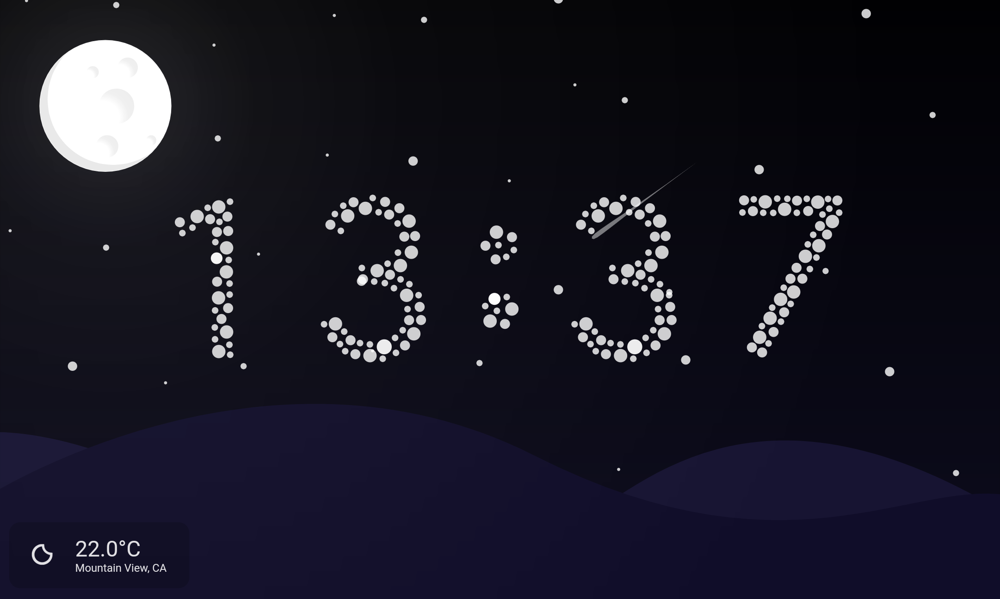
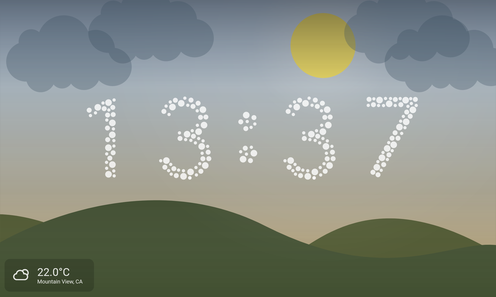
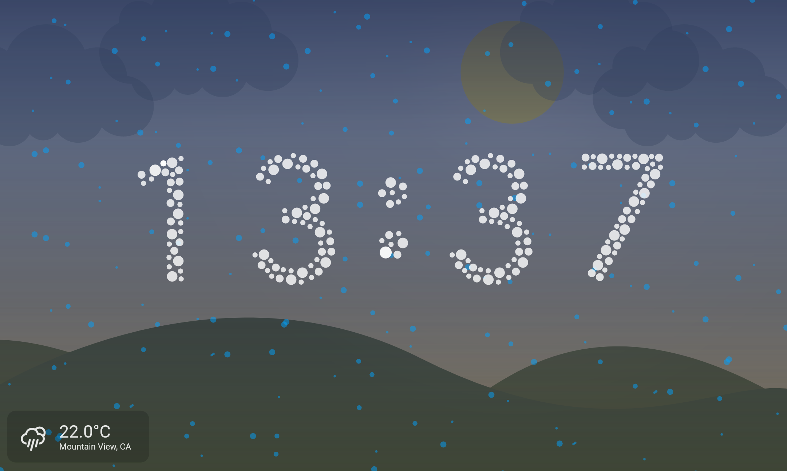
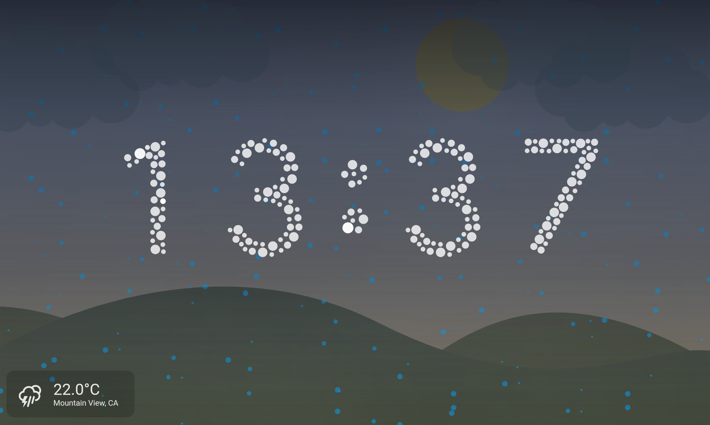

# Star Clock

This is my entry for the [Flutter Clock Face Contest](https://flutter.dev/clock).

Build instructions below.
**TLRD:** Clone with `--recurse-submodules`

#### Here's a small demo video:

### Screenshots

| Day mode (sunny)                                | Night mode                                      |
| ----------------------------------------------- | ----------------------------------------------- |
|  |  |

#### Weather (other)

| Cloudy                                            | Foggy                                           | Rainy                                           |
| ------------------------------------------------- | ----------------------------------------------- | ----------------------------------------------- |
|  |  |  |

| Snowy                                           | Thunderstorm                                                  | Windy                                           |
| ----------------------------------------------- | ------------------------------------------------------------- | ----------------------------------------------- |
|  |  |  |

### Building

-   `git clone --recurse-submodules https://github.com/ciriousjoker/star_clock`
-   `cd star_clock`
-   `flutter create --org de.ciriousjoker .`
-   `flutter pub run flutter_launcher_icons:main`
-   `flutter run --release`

### Flare animations

- Numbers: [0](https://rive.app/a/ciriousjoker/files/flare/number-0/preview), [1](https://rive.app/a/ciriousjoker/files/flare/number-1/preview), [2](https://rive.app/a/ciriousjoker/files/flare/number-2/preview), [3](https://rive.app/a/ciriousjoker/files/flare/number-3/preview), [4](https://rive.app/a/ciriousjoker/files/flare/number-4/preview), [5](https://rive.app/a/ciriousjoker/files/flare/number-5/preview), [6](https://rive.app/a/ciriousjoker/files/flare/number-6/preview), [7](https://rive.app/a/ciriousjoker/files/flare/number-7/preview), [8](https://rive.app/a/ciriousjoker/files/flare/number-8/preview), [9](https://rive.app/a/ciriousjoker/files/flare/number-9/preview)
- [background](https://rive.app/a/ciriousjoker/files/flare/background/preview)
- [colon](https://rive.app/a/ciriousjoker/files/flare/colon/preview)
- Weather conditions: [sunny](https://rive.app/a/ciriousjoker/files/flare/weather-sunny/preview),
[windy](https://rive.app/a/ciriousjoker/files/flare/weather-windy/preview), [snowy](https://rive.app/a/ciriousjoker/files/flare/weather-snowy/preview), [rainy](https://rive.app/a/ciriousjoker/files/flare/weather-rainy/preview), [windy](https://rive.app/a/ciriousjoker/files/flare/weather-windy/preview), [thunderstorm](https://rive.app/a/ciriousjoker/files/flare/weather-thunderstorm/preview)

### Notes

-   If Android produces a build error (something about plugins), delete the MainActivity.kt file and try again. This bug appeared in flutter beta. I couldn't reproduce it on flutter stable, but who knows what happens.
-   The web version has issues:
    -   shadow bug on hud
    -   performance issue
    -   WAY too strong glow on moon
    -   thunderstorm freezes the page
    -   svg icon doesn't render

### Legal

This project is licensed under the [MIT License](LICENSE).

The weather icon collection has its own license as described [here](https://github.com/erikflowers/weather-icons/#licensing).
At the time of writing this, this means OFL for the icons, MIT for the code & CC BY 3.0 for the documentation.

©2020 Google LLC All rights reserved. YouTube is a trademark of Google LLC.
