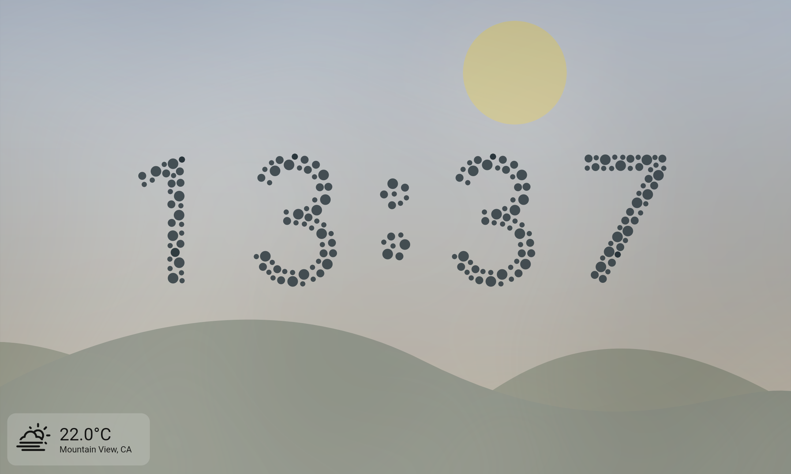
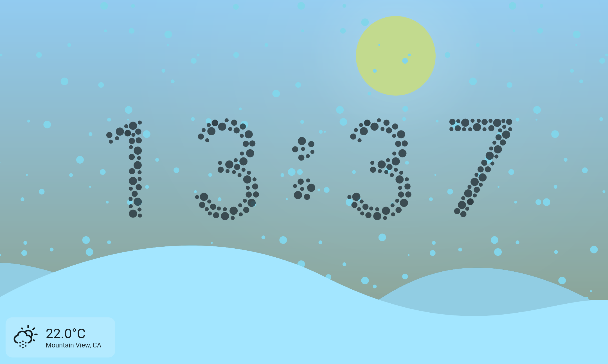
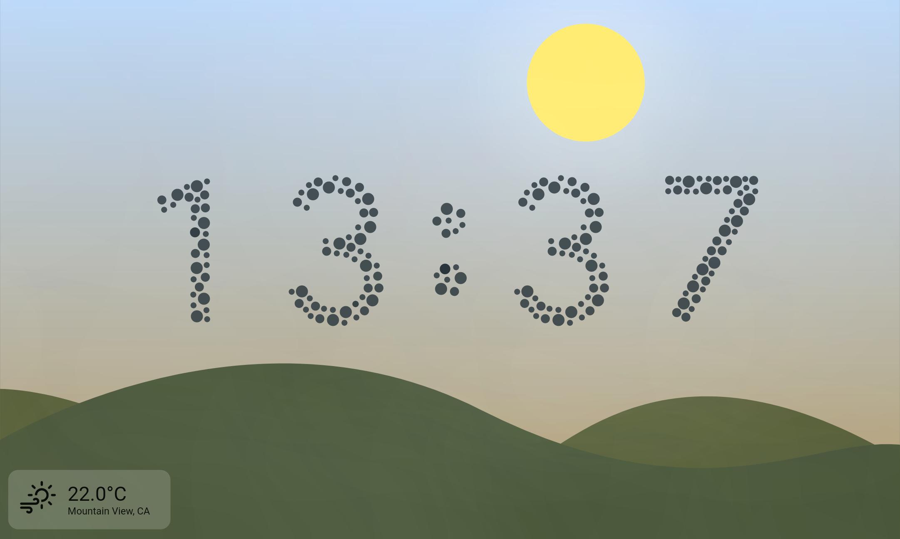

# Star Clock

This is my entry for the [Flutter Clock Face Contest](https://flutter.dev/clock).

Build instructions below.
TLRD: Clone with `--recurse-submodules`

### Screenshots

| Day mode (sunny)                   | Night mode                        |
| ---------------------------------- | --------------------------------- |
|  |  |

#### Weather (other)

| Cloudy                              | Foggy                             | Rainy                             |
| ----------------------------------- | --------------------------------- | --------------------------------- |
|  |  |  |

| Snowy                             | Thunderstorm                                    | Windy                             |
| --------------------------------- | ----------------------------------------------- | --------------------------------- |
|  |  |  |

### Building

-   `git clone --recurse-submodules https://github.com/ciriousjoker/star_clock`
-   `cd star_clock`
-   `flutter create .`
-   `flutter pub run flutter_launcher_icons:main`
-   `flutter run --release`

### Notes

-   If Android produces a build error (something about plugins), delete the MainActivity.kt file and try again. This bug appeared in flutter beta. I couldn't reproduce it on flutter stable, but who knows what happens.
-   The web version has issues:
    -   shadow bug on hud
    -   performance issue
    -   WAY too strong glow on moon
    -   thunderstorm freezes the page
    -   svg icon doesn't render
